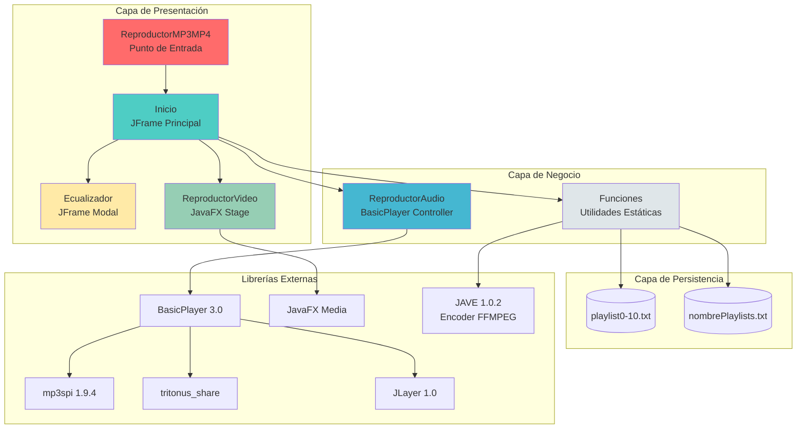
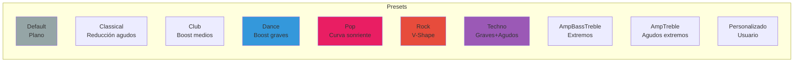
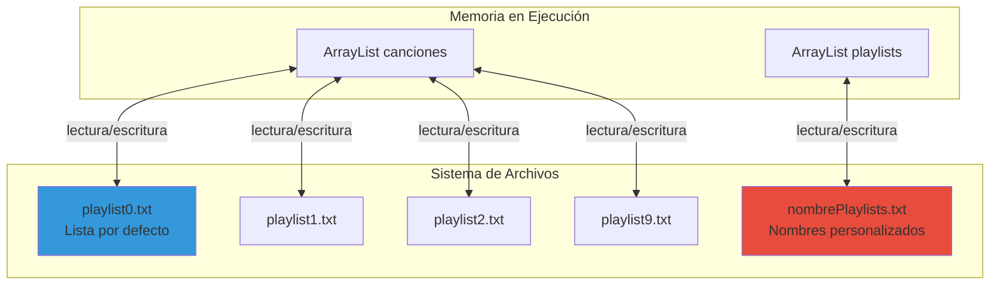
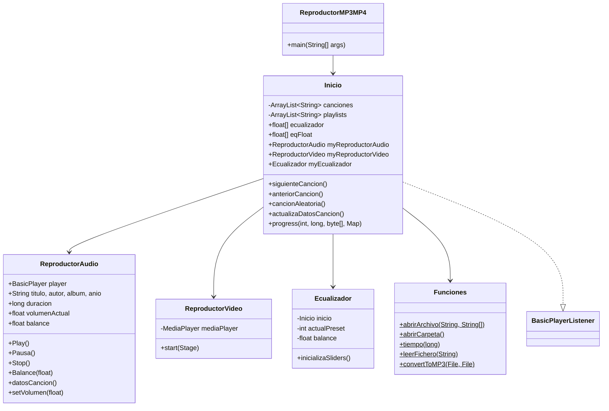
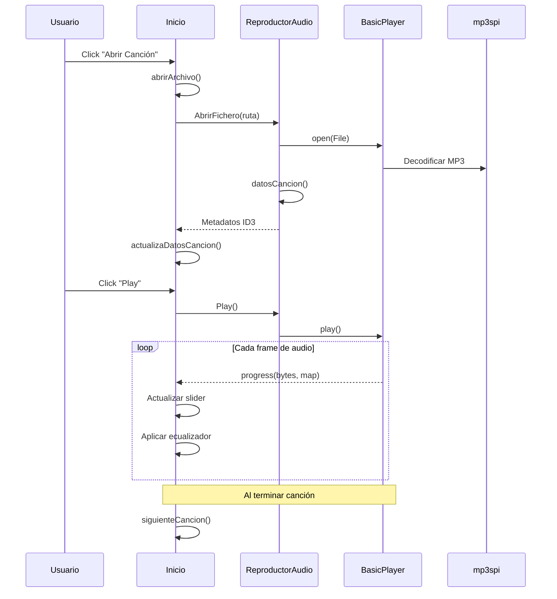

# 🎵 ReproductorMP3MP4


<p align="center">
  <strong>Reproductor multimedia de escritorio completo con soporte para audio MP3 y video MP4, ecualizador profesional de 10 bandas, gestión avanzada de playlists y conversión de formatos de audio.</strong>
</p>

---

## 📋 Tabla de Contenidos

- [El Problema que Resuelve](#-el-problema-que-resuelve)
- [Características Principales](#-características-principales)
- [Arquitectura del Sistema](#-arquitectura-del-sistema)
- [Tech Stack](#-tech-stack)
- [Instalación y Quick Start](#-instalación-y-quick-start)
- [Guía de Uso](#-guía-de-uso)
- [Módulos del Sistema](#-módulos-del-sistema)
- [Ecualizador - Lógica Central](#-ecualizador---lógica-central)
- [Sistema de Playlists](#-sistema-de-playlists)
- [Atajos de Teclado](#-atajos-de-teclado)
- [Diagramas UML](#-diagramas-uml)
- [Autores](#-autores)

---

## 🎯 El Problema que Resuelve

Los reproductores multimedia comerciales suelen ser pesados, llenos de funciones innecesarias y consumen muchos recursos del sistema. **ReproductorMP3MP4** ofrece una solución **ligera, eficiente y completamente funcional** para:

- ✅ **Reproducción fluida** de archivos MP3 con extracción automática de metadatos ID3
- ✅ **Reproducción de video MP4** en ventana independiente con controles intuitivos
- ✅ **Ecualizador profesional** con 10 bandas de frecuencia y 9 presets predefinidos
- ✅ **Gestión persistente de hasta 10 playlists** con nombres personalizables
- ✅ **Conversión de formatos de audio** a MP3 usando codificación LAME
- ✅ **Interfaz nativa de Windows** con look and feel del sistema operativo

---

## ✨ Características Principales

| Característica | Descripción |
|----------------|-------------|
| 🎵 **Reproducción MP3** | Soporte completo con BasicPlayer y mp3spi |
| 🎬 **Reproducción MP4** | Player JavaFX independiente con controles multimedia |
| 🎚️ **Ecualizador 10 bandas** | Frecuencias de 70Hz a 16kHz con ±12dB de ganancia |
| 🔊 **Control de audio** | Volumen, balance L/R, mute |
| 📋 **10 Playlists** | Gestión persistente con nombres personalizables |
| 🔀 **Modos de reproducción** | Aleatorio, repetición, secuencial |
| 📊 **Metadatos ID3** | Extracción de título, artista, álbum y año |
| 🔄 **Conversión de audio** | Cualquier formato a MP3 (128kbps, 44.1kHz, stereo) |
| ⌨️ **Atajos de teclado** | Control completo sin ratón |
| 📁 **Apertura masiva** | Archivos individuales o carpetas completas |

---

## 🏗️ Arquitectura del Sistema



---

## 🛠️ Tech Stack

### Lenguaje y Framework UI
| Tecnología | Versión | Propósito |
|------------|---------|-----------|
| **Java** | 11+ | Lenguaje principal |
| **Swing** | - | Interfaz gráfica principal |
| **JavaFX** | 11+ | Reproductor de video |
| **NetBeans AbsoluteLayout** | - | Layout manager |

### Librerías de Audio
| Librería | Versión | Función |
|----------|---------|---------|
| **BasicPlayer** | 3.0 | Motor de reproducción MP3 |
| **mp3spi** | 1.9.4 | SPI para decodificación MP3 |
| **JLayer** | 1.0 | Decodificador MPEG Layer III |
| **tritonus_share** | - | Extensiones de audio Java |
| **JAVE** | 1.0.2 | Conversión de formatos (wrapper FFMPEG) |

### Librerías de Video
| Librería | Propósito |
|----------|-----------|
| **javafx.media** | Reproducción multimedia |
| **javafx.controls** | Controles UI JavaFX |
| **javafx.swing** | Integración Swing-JavaFX |

### Look and Feel
| Librería | Propósito |
|----------|-----------|
| **Synthetica** | Tema visual personalizado |
| **SyntheticaAluOxide** | Skin metálico |
| **Substance** | Look and Feel alternativo |

---

## 🚀 Instalación y Quick Start

### Pre-requisitos

- **Java JDK 11** o superior
- **JavaFX SDK** (si no está incluido en el JDK)
- Sistema operativo **Windows** (para look and feel nativo)

### Opción 1: Ejecutar JAR Pre-compilado

```powershell
# Navegar al directorio del ejecutable
cd Ejecutable

# Ejecutar la aplicación
java -jar ReproductorMP3MP4.jar
```

### Opción 2: Compilar desde el Código Fuente

```powershell
# Clonar el repositorio
git clone https://github.com/Rubenpg4/Reproductor-MP3-MP4.git

# Navegar al proyecto
cd Reproductor-MP3-MP4/ReproductorMP3MP4

# Compilar con las dependencias (asumiendo que están en lib/)
javac -cp "lib/*" -d build src/miReproductor/*.java

# Ejecutar
java -cp "build;lib/*" miReproductor.ReproductorMP3MP4
```

### Estructura de Directorios Requerida

```
📁 Ejecutable/
├── 📄 ReproductorMP3MP4.jar
├── 📁 lib/                    # Todas las dependencias JAR
│   ├── basicplayer3.0.jar
│   ├── mp3spi1.9.4.jar
│   ├── jl1.0.jar
│   ├── tritonus_share.jar
│   ├── jave-1.0.2.jar
│   ├── javafx.media.jar
│   └── ... (otras dependencias)
├── 📄 playlist0.txt - playlist10.txt  # Auto-generados
└── 📄 nombrePlaylists.txt              # Auto-generado
```

---

## 📖 Guía de Uso

### Reproducción de Audio MP3

1. **Archivo → Abrir Canción** (`Ctrl+A`) para seleccionar archivos MP3
2. **Archivo → Abrir Carpeta** (`Ctrl+C`) para cargar todos los archivos de una carpeta
3. Usa los controles de reproducción: ▶️ Play, ⏸️ Pausa, ⏹️ Stop, ⏮️ Anterior, ⏭️ Siguiente

### Reproducción de Video MP4

1. **Archivo → Video Player** (`Ctrl+V`) abre una ventana independiente
2. Usa **ABRIR VIDEO** para seleccionar el archivo MP4
3. Controles disponibles: Play, Pausa, Reiniciar, Cerrar
4. Slider de progreso para navegación temporal

### Uso del Ecualizador

1. Clic en el botón **🎚️ Ecualizador** en la interfaz principal
2. Selecciona un preset del desplegable o ajusta manualmente las bandas
3. Ajusta el **Balance** L/R con el slider horizontal

---

## 📦 Módulos del Sistema

### `ReproductorMP3MP4.java` - Punto de Entrada

```java
public class ReproductorMP3MP4 {
    public static void main(String args[]) {
        // Configura Look and Feel de Windows
        UIManager.setLookAndFeel("Windows");
        // Inicia la interfaz principal
        new Inicio().setVisible(true);
    }
}
```

**Responsabilidad**: Configuración inicial del sistema y carga de la interfaz principal.

---

### `Inicio.java` - Controlador Principal (1970 líneas)

<details>
<summary><strong>🔍 Expandir detalles de la clase Inicio</strong></summary>

La clase `Inicio` es el **núcleo de la aplicación**, implementando:

| Componente | Descripción |
|------------|-------------|
| `JFrame` | Ventana principal Swing |
| `BasicPlayerListener` | Interface para eventos de reproducción |
| `JTable` | Lista de canciones interactiva |
| `JSlider` | Controles de volumen y progreso |
| `JMenuBar` | Sistema de menús completo |

**Atributos Principales:**

```java
private ArrayList<String> canciones;      // Lista de rutas de canciones
private ArrayList<String> playlists;       // Playlists actuales
public static float ecualizador[];         // Valores del EQ (10 bandas)
public static float eqFloat[];             // Valores normalizados (32 bandas)
public ReproductorAudio myReproductorAudio; // Controlador de audio
public ReproductorVideo myReproductorVideo; // Controlador de video
public Ecualizador myEcualizador;          // Ventana del ecualizador
```

**Métodos Clave:**

| Método | Función |
|--------|---------|
| `siguienteCancion()` | Avanza a la siguiente pista |
| `anteriorCancion()` | Retrocede a la pista anterior |
| `cancionAleatoria()` | Selección aleatoria de pista |
| `repetirCancion()` | Repite la pista actual |
| `llenarTabla()` | Actualiza la JTable con las canciones |
| `actualizaDatosCancion()` | Muestra metadatos ID3 |
| `progress()` | Callback de progreso de reproducción |

</details>

---

### `ReproductorAudio.java` - Motor de Audio

<details>
<summary><strong>🔍 Expandir detalles del motor de audio</strong></summary>

Encapsula el **BasicPlayer** para control de reproducción MP3:

```java
public class ReproductorAudio {
    public BasicPlayer player;        // Motor de reproducción
    String ruta, titulo, autor, album, anio;  // Metadatos ID3
    long duracion;                    // Duración en segundos
    float volumenActual;              // Volumen normalizado [0-1]
    float balance;                    // Balance L/R [-1 a 1]
    
    public void Play();               // Reproducir/Continuar
    public void Pausa();              // Pausar reproducción
    public void Stop();               // Detener reproducción
    public void Balance(float bal);   // Ajustar balance L/R
    public void datosCancion();       // Extraer metadatos ID3
    public void pulsaProgreso();      // Seek en la pista
    public void setVolumen(float v);  // Ajustar volumen
}
```

**Extracción de Metadatos ID3:**

```java
public void datosCancion() {
    AudioFileFormat baseFileFormat = AudioSystem.getAudioFileFormat(mp3Archivo);
    if (baseFileFormat instanceof TAudioFileFormat) {
        Map properties = ((TAudioFileFormat)baseFileFormat).properties();
        titulo = (String)properties.get("title");
        autor = (String)properties.get("author");
        album = (String)properties.get("album");
        anio = (String)properties.get("date");
        duracion = (long)properties.get("duration") / 1000000;
    }
}
```

</details>

---

### `ReproductorVideo.java` - Player JavaFX

<details>
<summary><strong>🔍 Expandir detalles del reproductor de video</strong></summary>

Implementa un player de video independiente usando **JavaFX MediaPlayer**:

```java
public class ReproductorVideo {
    private MediaPlayer mediaPlayer;  // Motor de video JavaFX
    
    public void start(Stage primaryStage) {
        // UI: Botones, MediaView, Slider de progreso
        // Eventos: Open, Play, Pause, Stop, Close
        // Configuración: 800x600px, no redimensionable
    }
}
```

**Características del Player:**

- 📂 Selector de archivos con filtro MP4
- ▶️⏸️⏹️ Controles de reproducción completos
- 📊 Slider de progreso interactivo
- 🔄 Soporte para resize automático del video
- 🎨 Interfaz con estilo CSS personalizado

</details>

---

### `Funciones.java` - Utilidades Estáticas

<details>
<summary><strong>🔍 Expandir detalles de utilidades</strong></summary>

Colección de métodos estáticos para operaciones comunes:

| Método | Descripción |
|--------|-------------|
| `abrirArchivo()` | Diálogo para seleccionar archivos MP3 |
| `agregarArchivo()` | Añade archivos a lista existente |
| `abrirCarpeta()` | Carga todos los archivos de un directorio |
| `agregarCarpeta()` | Añade carpeta a lista existente |
| `tiempo(long segundos)` | Formatea segundos a `MM:SS` o `HH:MM:SS` |
| `leerFichero()` | Lee playlist desde archivo de texto |
| `escribirPlaylistFich()` | Guarda playlist en archivo |
| `aniadirPlaylists()` | Crea archivo de playlist vacío |
| `borraPlaylist()` | Limpia contenido de playlist |
| `guardaNombrePlaylists()` | Persiste nombres de playlists |
| `convertToMP3()` | Convierte cualquier audio a MP3 |

**Conversión de Audio con JAVE:**

```java
public static void convertToMP3(File source, File target) {
    AudioAttributes audio = new AudioAttributes();
    audio.setCodec("libmp3lame");      // Codec LAME
    audio.setBitRate(128000);           // 128 kbps
    audio.setChannels(2);               // Stereo
    audio.setSamplingRate(44100);       // 44.1 kHz CD Quality
    
    EncodingAttributes attrs = new EncodingAttributes();
    attrs.setFormat("mp3");
    attrs.setAudioAttributes(audio);
    
    Encoder encoder = new Encoder();
    encoder.encode(source, target, attrs);
}
```

</details>

---

## 🎚️ Ecualizador - Lógica Central

### Bandas de Frecuencia

El ecualizador implementa **10 bandas** cubriendo el espectro audible humano:

| Banda | Frecuencia | Tipo de Sonido |
|-------|------------|----------------|
| 1 | 70 Hz | Sub-graves profundos |
| 2 | 180 Hz | Graves |
| 3 | 320 Hz | Graves medios |
| 4 | 600 Hz | Medios bajos |
| 5 | 1 kHz | Medios |
| 6 | 3 kHz | Medios altos |
| 7 | 6 kHz | Presencia |
| 8 | 12 kHz | Brillo |
| 9 | 14 kHz | Agudos |
| 10 | 16 kHz | Aire/Ultraagudos |

### Presets Disponibles



### Implementación Técnica

El ecualizador manipula el array `mp3.equalizer` del BasicPlayer en tiempo real:

```java
// En Inicio.java - método progress()
ecualizador = (float[])map.get("mp3.equalizer");
System.arraycopy(eqFloat, 0, ecualizador, 0, ecualizador.length);
```

Cada slider modifica valores normalizados entre **-1.0** (−12dB) y **+1.0** (+12dB).

---

## 📋 Sistema de Playlists

### Arquitectura de Persistencia



### Formato de Archivos

**playlist[N].txt** - Una ruta de archivo MP3 por línea:
```
C:\Musica\cancion1.mp3
C:\Musica\cancion2.mp3
D:\Downloads\otra_cancion.mp3
```

**nombrePlaylists.txt** - Nombres personalizados:
```
Rock Clásico
Workout Mix
Chill Vibes
...
```

### Operaciones de Playlist

| Operación | Descripción |
|-----------|-------------|
| 📥 **Importar** | Copia la lista principal a la playlist actual |
| ➕ **Añadir canción** | Agrega archivos MP3 a la playlist |
| 📂 **Añadir carpeta** | Agrega todos los archivos de una carpeta |
| 🗑️ **Borrar** | Limpia el contenido de la playlist |
| ▶️ **Reproducir** | Carga y reproduce la playlist |
| ✏️ **Renombrar** | Click en el nombre para editar |

---

## ⌨️ Atajos de Teclado

### Archivo
| Atajo | Acción |
|-------|--------|
| `Ctrl+A` | Abrir canción |
| `Ctrl+C` | Abrir carpeta |
| `Ctrl+V` | Video Player |
| `Ctrl+Shift+A` | Agregar canción |
| `Ctrl+Shift+C` | Agregar carpeta |
| `Alt+F4` | Salir |

### Reproducción
| Atajo | Acción |
|-------|--------|
| `Ctrl+R` | Reproducir |
| `Ctrl+P` | Pausar |
| `Ctrl+S` | Stop |
| `Ctrl+Shift+→` | Siguiente |
| `Ctrl+Shift+←` | Anterior |

### Audio
| Atajo | Acción |
|-------|--------|
| `Ctrl+↑` | Subir volumen |
| `Ctrl+↓` | Bajar volumen |
| `Ctrl+M` | Mute |
| `Ctrl+Alt+A` | Modo aleatorio |
| `Ctrl+Alt+R` | Modo repetición |

### Playlists
| Atajo | Acción |
|-------|--------|
| `Ctrl+0` | Lista por defecto |
| `Ctrl+1-9` | Playlist 1-9 |

---

## 📊 Diagramas UML

### Diagrama de Clases Simplificado



### Flujo de Reproducción de Audio



---

## 👥 Autores

| Autor | Contribución |
|-------|--------------|
| **Rubén Prieto García** | Arquitectura principal, interfaz Swing, sistema de playlists, funciones de utilidad |
| **Pablo Valdivia** | Reproductor de audio, ecualizador, reproductor de video JavaFX |

---

## 📄 Documentación Adicional

- 📘 `DocumentacionMultimedia.pdf` - Documentación técnica completa del proyecto
- 📐 `Diagramas/Multimedia.vpp` - Diagramas UML en Visual Paradigm

---

<p align="center">
  <sub>Desarrollado como proyecto académico de Aplicaciones Multimedia</sub>
</p>
